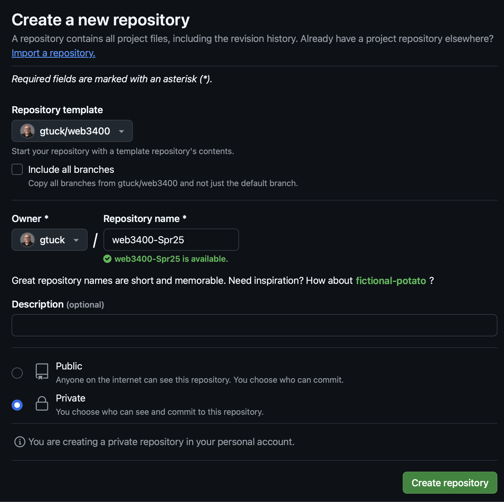
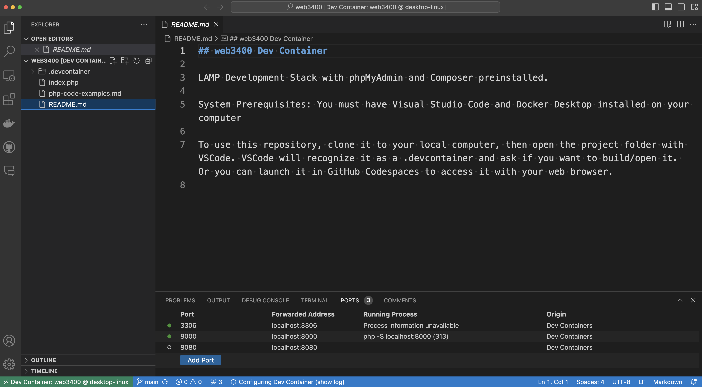

## Developer Environment Setup & Configuration

### Overview
This assignment introduces the essential tools and technologies needed for server-side web development. You will set up a development environment that includes a GitHub account, GitHub Desktop, Docker Desktop, and Visual Studio Code. Additionally, you will learn to work with repositories and containers—key skills for modern web development.

### Objectives
- Get familiar with GitHub and GitHub Desktop.
- Understand Docker and containerization basics.
- Learn to use Visual Studio Code for development.
- Gain experience working with repositories and development environments.

### Requirements

**1. Create a GitHub Account**

- **Sign Up**: Visit [GitHub's Sign-Up Page](https://github.com/join).
- **Email**: Use your university email address (`@mail.weber.edu`) during registration.
- **Profile Completion**: Fill in your name and any other required details to complete your profile.

**2. Install GitHub Desktop**

- **Download**: Go to [GitHub Desktop's Website](https://desktop.github.com/) and download the installer compatible with your operating system.
- **Installation**: Run the downloaded installer and follow the on-screen instructions to install GitHub Desktop.
- **Sign In**: Open GitHub Desktop and sign in with your GitHub credentials.

**3. Create a Private `web3400-Spr25` Repository**

- **Accept Invitation**: Check your university email for a collaboration invitation and accept it.
- **Access Template**: Navigate to the [web3400 repository template](https://github.com/gtuck/web3400).
- **Create Repository**: Click on the "Use this template" button and select "Create a new repository."
- **Repository Name**: Name your repository `web3400-Spr25`.
- **Add Collaborator**:
  - Go to your repository's page.
  - Click on the "Settings" tab.
  - Select "Collaborators" from the sidebar.
  - Enter `gtuck@weber.edu` and send an invitation.
- Example settings:
     

**4. Install Docker Desktop**

- **Download**: Visit [Docker Desktop's Website](https://www.docker.com/products/docker-desktop/) and download the installer for your operating system.
- **Installation**: Run the installer and follow the instructions to install Docker Desktop.
- **Launch Docker**: Open Docker Desktop to ensure it's running.

**5. Install Visual Studio Code (VS Code)**

- **Download**: Go to [Visual Studio Code's Website](https://code.visualstudio.com/) and download the installer for your operating system.
- **Installation**: Run the installer and follow the on-screen instructions to install VS Code.

**6. Clone Your `web3400-Spr25` Repository Locally**

- **Open GitHub Desktop**:
  - Click on "File" > "Clone Repository."
  - Select the `web3400-Spr25` repository from the list.
  - Choose a local path on your computer to store the repository.
  - Click "Clone."

**7. Open the Project in VS Code**

- **Open VS Code**:
  - Click on "File" > "Open Folder."
  - Navigate to the folder where you cloned the repository and select it.
  - Build and run the container when prompted by the `.devcontainer` file.

**8. Verify the Setup**

- **Check Services**:
  - Ensure the web server and database services are running within the container.
- **Access Application**:
  - Open a web browser and navigate to `http://localhost:8000` to see if the default application page loads.

**9. Commit and Push Changes**

- **Make a Change**:
  - Edit the `README.md` file in VS Code to personalize it.
- **Commit Changes**:
  - In GitHub Desktop, you should see the changes listed.
  - Add a summary message like "Updated README" and click "Commit to main."
- **Push to GitHub**:
  - Click "Push origin" to upload your changes to GitHub.
 
##10 Deliverables and Submission Guidelines
- A screenshot of Visual Studio Code with the `web3400-Spr25` repository open and the Docker `.devcontainer` running (locally or in Codespaces).

- Submit a `.jpg` or `.png` screenshot via the course submission link before the deadline.

---

This assignment lays the foundation for mastering server-side web development. Setting up a robust development environment is essential for effective coding. If you face any challenges, feel free to ask for help. Good luck!
