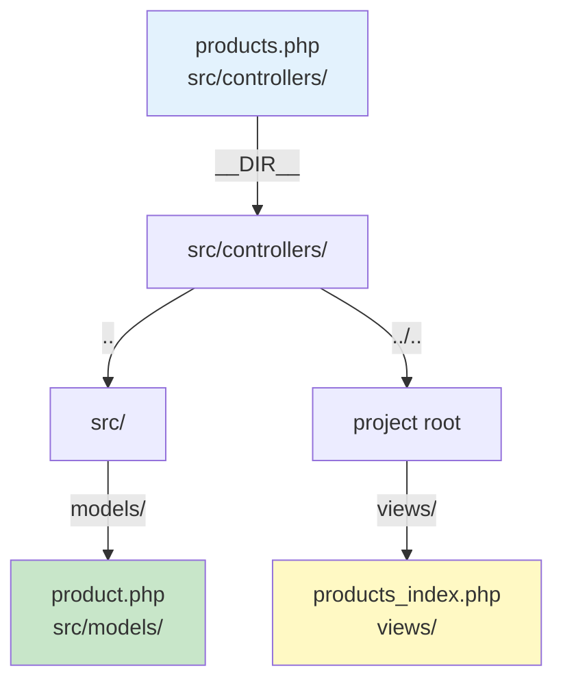
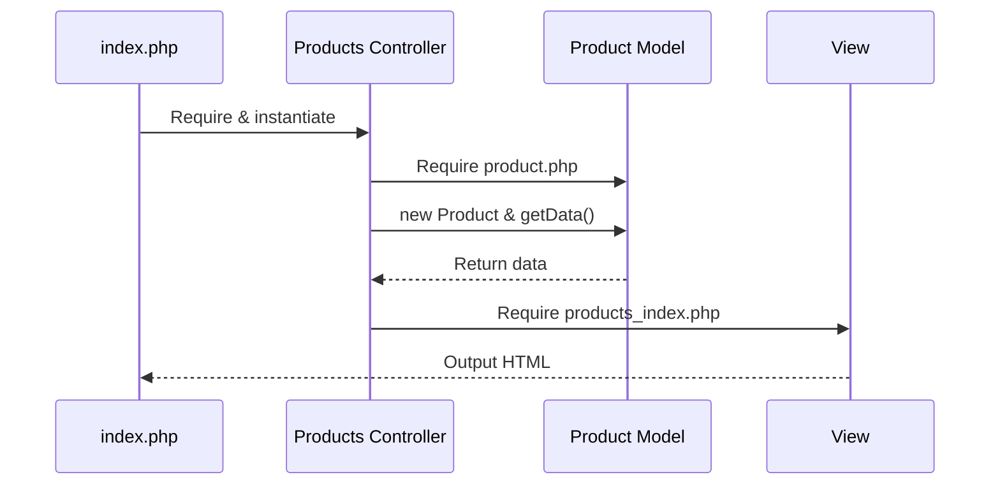

# Organizing MVC Files into Folders

From Flat Structure to Professional Organization

---
layout: two-cols
---

# Current Structure

Flat file organization from Project 02

```
project-02/
├── index.php
├── controller.php
├── model.php
└── view.php
```

<div class="mt-8" v-click>

## Problems

- All files at root level
- Generic names don't scale
- What happens with 10+ models?
- What happens with 20+ controllers?
- No clear organization

</div>

::right::

# Goal Structure

Professional folder organization

```
project-03/
├── index.php
├── src/
│   ├── controllers/
│   │   └── products.php
│   └── models/
│       └── product.php
└── views/
    └── products_index.php
```

<div class="mt-8" v-click>

## Benefits

- Clear organization
- Scalable structure
- Specific names
- Industry standard
- Easy to navigate

</div>

---

# Why Organize into Folders?

Professional PHP application structure

<div class="grid grid-cols-2 gap-8 mt-8">

<div v-click>

## Scalability
```
src/
├── controllers/
│   ├── products.php
│   ├── posts.php
│   ├── contacts.php
│   ├── users.php
│   ├── orders.php
│   └── ...
└── models/
    ├── product.php
    ├── post.php
    ├── contact.php
    └── ...
```

Easy to add more files!

</div>

<div v-click>

## Navigation
- Need to find product logic?
  → `src/models/product.php`
- Need to fix display?
  → `views/products_index.php`
- Need to check controller?
  → `src/controllers/products.php`

**Know exactly where to look!**

</div>

</div>

---

# Understanding the Folders

Three main organizational units

<div class="grid grid-cols-3 gap-4 mt-8">

<div v-click>

## `src/`
**Source Code**

- Pure PHP classes
- Business logic
- Controllers
- Models
- Industry standard
- Can add namespaces later

</div>

<div v-click>

## `src/models/`
**Data Layer**

- Database operations
- Business logic
- **Singular naming**
- One file per table
- `product.php`
- `post.php`

</div>

<div v-click>

## `src/controllers/`
**Application Logic**

- Request handling
- Coordinates M & V
- **Plural naming**
- One per resource type
- `products.php`
- `posts.php`

</div>

</div>

<div class="mt-8" v-click>

## Why `views/` separate?
- Not pure PHP (mostly HTML)
- Presentation layer
- Different purpose than classes
- Stays at root level

</div>

---

# Naming Conventions

Critical rules for organization

<div class="mt-8">

| Component | Convention | Examples | Why? |
|-----------|-----------|----------|------|
| **Model Class** | Singular, StudlyCaps | `Product`, `Post` | Represents ONE instance |
| **Model File** | Singular, lowercase | `product.php` | Matches class concept |
| **Controller Class** | Plural, StudlyCaps | `Products`, `Posts` | Handles ALL of a resource |
| **Controller File** | Plural, lowercase | `products.php` | Matches class concept |
| **View File** | `{resource}_{action}` | `products_index.php` | Descriptive and clear |

</div>

<div class="mt-8 grid grid-cols-2 gap-4">

<div v-click>

### Database → Model
- `products` table → `Product` model
- `posts` table → `Post` model
- `contacts` table → `Contact` model

</div>

<div v-click>

### Controller → Views
- `Products` controller → `products_*` views
- `Posts` controller → `posts_*` views
- `Contacts` controller → `contacts_*` views

</div>

</div>

---

# Step 1: Create Folders

Build the directory structure

<div class="grid grid-cols-2 gap-4 mt-4">

<div>

## Command
```bash
mkdir -p src/models src/controllers views
```

## Result
```
project-03/
├── src/
│   ├── models/
│   └── controllers/
└── views/
```

</div>

<div v-click>

## Explanation

- `src/` holds PHP classes
- `models/` inside `src/`
- `controllers/` inside `src/`
- `views/` at root level
- Empty and ready!

</div>

</div>

<div class="mt-8 p-4 bg-blue-50 dark:bg-blue-900 rounded" v-click>

**Pro tip:** The `-p` flag creates parent directories automatically and doesn't error if folders already exist.

</div>

---

# Step 2: Rename & Move Model

Model represents a Product (singular)

<div class="grid grid-cols-2 gap-4">

<div v-click>

## Before
**File:** `model.php`
**Location:** Root

```php
<?php

class Model
{
    public function getData(): array
    {
        // Database code...
    }
}
```

</div>

<div v-click>

## After
**File:** `product.php`
**Location:** `src/models/`

```php
<?php

class Product
{
    public function getData(): array
    {
        // Database code...
    }
}
```

<div class="mt-4 p-3 bg-green-50 dark:bg-green-900 rounded text-sm">

✓ Singular name<br>
✓ StudlyCaps<br>
✓ In models folder

</div>

</div>

</div>

---

# Why Singular for Models?

Understanding the convention

<div class="mt-8">

## A Model = One Instance

```php
$product = new Product;  // ONE product
$post = new Post;       // ONE post
$user = new User;       // ONE user
```

</div>

<div class="grid grid-cols-2 gap-4 mt-8">

<div v-click>

## Database Tables (Plural)
```
products    (many rows)
posts       (many rows)
contacts    (many rows)
```

Collections of records

</div>

<div v-click>

## Model Classes (Singular)
```php
Product     (one object)
Post        (one object)
Contact     (one object)
```

Individual instances

</div>

</div>

<div class="mt-8 text-center text-xl" v-click>

**Rule:** `products` table → `Product` model

</div>

---

# Step 3: Rename & Move Controller

Controller handles Products (plural)

<div class="grid grid-cols-2 gap-4">

<div v-click>

## Before
**File:** `controller.php`
**Location:** Root

```php
<?php

class Controller
{
    public function index()
    {
        require "model.php";

        $model = new Model;

        $posts = $model->getData();

        require "view.php";
    }
}
```

</div>

<div v-click>

## After
**File:** `products.php`
**Location:** `src/controllers/`

```php
<?php

class Products
{
    public function index()
    {
        require __DIR__ . "/../models/product.php";

        $product = new Product;

        $posts = $product->getData();

        require __DIR__ . "/../../views/products_index.php";
    }
}
```

</div>

</div>

---

# Understanding the Path Changes

Working with `__DIR__` for reliable paths

<div class="mt-4">

## What is `__DIR__`?
Magic constant = absolute path of current file's directory

</div>

<div class="grid grid-cols-2 gap-4 mt-4">

<div v-click>

## Current file location
```
/project/src/controllers/products.php
```

`__DIR__` = `/project/src/controllers`

</div>

<div v-click>

## Model path (up one, into models)
```php
__DIR__ . "/../models/product.php"
```

Result: `/project/src/models/product.php`

</div>

</div>

<div v-click>

## View path (up two, into views)
```php
__DIR__ . "/../../views/products_index.php"
```

Result: `/project/views/products_index.php`

</div>

<div class="mt-4 p-4 bg-yellow-50 dark:bg-yellow-900 rounded" v-click>

**Why use `__DIR__`?** Makes paths work regardless of where you run PHP from. No more "file not found" errors!

</div>

---

# Visual: Path Navigation

From controller to other files



<div class="grid grid-cols-2 gap-4 mt-8">

<div>

## Model Path
1. Start at `src/controllers/`
2. Go up one level: `../`
3. Enter models: `models/`
4. File: `product.php`

</div>

<div>

## View Path
1. Start at `src/controllers/`
2. Go up two levels: `../../`
3. Enter views: `views/`
4. File: `products_index.php`

</div>

</div>

---

# Why Plural for Controllers?

Understanding resource management

<div class="mt-8">

## A Controller = All Operations for a Resource

```php
class Products  // Handles ALL product operations
{
    public function index()   // List all products
    public function show()    // Show one product
    public function create()  // Show create form
    public function store()   // Save new product
    public function edit()    // Show edit form
    public function update()  // Update product
    public function destroy() // Delete product
}
```

</div>

<div class="mt-8 text-center text-xl" v-click>

**One controller manages the entire resource lifecycle**

</div>

---

# Step 4: Rename & Move View

View shows products index

<div class="grid grid-cols-2 gap-4">

<div v-click>

## Before
**File:** `view.php`
**Location:** Root

Generic name, unclear purpose

</div>

<div v-click>

## After
**File:** `products_index.php`
**Location:** `views/`

Descriptive name, clear purpose!

</div>

</div>

<div class="mt-8" v-click>

## View Naming Pattern

`{resource}_{action}.php`

- `products_index.php` - list products
- `products_show.php` - show one product
- `products_edit.php` - edit form
- `posts_index.php` - list posts
- `contacts_index.php` - list contacts

</div>

<div class="mt-4 p-4 bg-green-50 dark:bg-green-900 rounded" v-click>

**Why this naming?** Instantly know what resource and action the view handles!

</div>

---

# View File Details

No code changes needed

```php
<!DOCTYPE html>
<html>
<head>
    <title>Blog Posts</title>
    <meta charset="UTF-8">
</head>
<body>

<h1>Blog Posts</h1>

<?php foreach ($posts as $post): ?>

    <h2><?= htmlspecialchars($post["title"]) ?></h2>
    <p><?= htmlspecialchars($post["body"]) ?></p>

<?php endforeach; ?>

</body>
</html>
```

<div class="mt-4 p-4 bg-blue-50 dark:bg-blue-900 rounded">

**Just move and rename** - the HTML and display logic stay exactly the same!

</div>

---

# Step 5: Update index.php

Entry point uses new structure

<div class="grid grid-cols-2 gap-4">

<div v-click>

## Before

```php
<?php

require "controller.php";

$controller = new Controller;

$controller->index();
```

Simple but generic

</div>

<div v-click>

## After

```php
<?php

require "src/controllers/products.php";

$controller = new Products;

$controller->index();
```

Clear and specific!

</div>

</div>

<div class="mt-8" v-click>

## Changes Made
1. Path: `"controller.php"` → `"src/controllers/products.php"`
2. Class: `Controller` → `Products`
3. Still clean and simple!

</div>

---

# Complete File Structure

Final organized project

<div class="grid grid-cols-2 gap-4">

<div>

## Directory Tree
```
project-03/
├── index.php
├── src/
│   ├── controllers/
│   │   └── products.php
│   └── models/
│       └── product.php
└── views/
    └── products_index.php
```

</div>

<div v-click>

## File Purposes

**index.php**
Entry point (5 lines)

**products.php**
Products controller (plural)

**product.php**
Product model (singular)

**products_index.php**
Product list view

</div>

</div>

<div class="mt-8" v-click>

## Flow of Execution



</div>

---
layout: two-cols
---

# Before: Flat Structure

Everything at root level

```
project-02/
├── index.php
├── controller.php
├── model.php
└── view.php
```

## Problems
- ❌ Generic names
- ❌ No organization
- ❌ Doesn't scale
- ❌ Hard to navigate
- ❌ Unclear purpose

::right::

# After: Organized Structure

Professional folder organization

```
project-03/
├── index.php
├── src/
│   ├── controllers/
│   │   └── products.php
│   └── models/
│       └── product.php
└── views/
    └── products_index.php
```

## Benefits
- ✓ Specific names
- ✓ Clear organization
- ✓ Scales easily
- ✓ Easy to navigate
- ✓ Clear purpose

---

# Scaling Example

Easy to add more resources

```
project-03/
├── index.php
├── src/
│   ├── controllers/
│   │   ├── products.php
│   │   ├── posts.php
│   │   ├── contacts.php
│   │   └── home.php
│   └── models/
│       ├── product.php
│       ├── post.php
│       └── contact.php
└── views/
    ├── products_index.php
    ├── products_show.php
    ├── posts_index.php
    ├── posts_show.php
    ├── contacts_index.php
    └── home_index.php
```

<div class="mt-4 p-4 bg-green-50 dark:bg-green-900 rounded">

**Just add files to the appropriate folders!** Structure stays clear and maintainable.

</div>

---

# Benefits of Organized Structure

Why this matters

<div class="grid grid-cols-2 gap-4 mt-4">

<div v-click>

## 1. Scalability
Add 100 models? No problem!
```
src/
└── models/
    ├── product.php
    ├── post.php
    ├── ... (98 more)
```

</div>

<div v-click>

## 2. Convention Over Configuration
- Other devs understand instantly
- Framework-like organization
- Easy to learn
- Predictable structure

</div>

<div v-click>

## 3. Clear Separation
- Pure PHP → `src/`
- HTML templates → `views/`
- Entry points → root
- Clear boundaries!

</div>

<div v-click>

## 4. Easy Navigation
- Controller issue? → `src/controllers/`
- Model bug? → `src/models/`
- Display problem? → `views/`
- Know where to look!

</div>

</div>

<div class="mt-4" v-click>

## 5. Professional Standards
- Matches industry practices
- PSR-compatible structure
- Ready for frameworks
- Prepares for namespaces/autoloading

</div>

---

# Common Mistakes

Watch out for these errors

<div class="grid grid-cols-2 gap-4 mt-4">

<div>

## Wrong Names

❌ `Products` model (plural)
✓ `Product` model (singular)

❌ `Product` controller (singular)
✓ `Products` controller (plural)

❌ `product_index.php` view
✓ `products_index.php` view

</div>

<div>

## Wrong Folders

❌ `controller/` (missing s)
✓ `controllers/`

❌ `src/views/`
✓ `views/` (at root)

❌ `Controllers/` (capital)
✓ `controllers/` (lowercase)

</div>

</div>

<div class="mt-4" v-click>

## Path Problems

❌ `require "../models/product.php"`
✓ `require __DIR__ . "/../models/product.php"`

❌ Wrong number of `../`
✓ Count levels carefully!

</div>

<div class="mt-4 p-4 bg-red-50 dark:bg-red-900 rounded" v-click>

**Most common error:** Moving files but forgetting to update paths!

</div>

---

# Testing Your Work

Verify after each step

<div class="mt-4">

## After Each Change

1. Open page in browser
2. Check for PHP errors
3. Verify posts still display
4. Output should be identical

</div>

<div class="grid grid-cols-2 gap-4 mt-8">

<div v-click>

## ✓ Success Looks Like
- No error messages
- Posts display correctly
- Same output as before
- All paths resolve

</div>

<div v-click>

## ❌ Common Errors
```
Warning: require(model.php):
failed to open stream:
No such file or directory
```

**Fix:** Check your paths!
Use `__DIR__` properly.

</div>

</div>

<div class="mt-4 p-4 bg-blue-50 dark:bg-blue-900 rounded" v-click>

**Pro tip:** Test after EACH step, not just at the end. Easier to find issues!

</div>

---

# Singular vs Plural Review

Quick reference guide

<div class="grid grid-cols-2 gap-8 mt-8">

<div>

## Singular (Models)
**Why:** Represents ONE instance

### Database → Model
- `products` → `Product`
- `posts` → `Post`
- `contacts` → `Contact`
- `users` → `User`

### Usage
```php
$product = new Product;
$post = new Post;
```

</div>

<div>

## Plural (Controllers)
**Why:** Handles ALL operations

### Resource → Controller
- products → `Products`
- posts → `Posts`
- contacts → `Contacts`
- users → `Users`

### Usage
```php
$controller = new Products;
$controller = new Posts;
```

</div>

</div>

<div class="mt-8 text-center text-xl font-bold" v-click>

Model = Singular | Controller = Plural

</div>

---

# Key Takeaways

What we learned

1. **Professional organization** uses `src/` for classes, `views/` for templates

2. **Models are singular** - represent one instance (`Product`, `Post`)

3. **Controllers are plural** - handle all requests (`Products`, `Posts`)

4. **Views use pattern** - `{resource}_{action}.php` naming

5. **Use `__DIR__`** for reliable path resolution in nested folders

6. **Same functionality** with better organization = successful refactoring

7. **Follow conventions** - makes code predictable and maintainable

<div class="mt-8 text-center text-2xl font-bold">

Organize → Scale → Succeed

</div>

---

# Preparing for the Future

This structure enables...

<div class="mt-8">

## Namespaces (Coming Soon)
```php
namespace App\Models;
namespace App\Controllers;
```

## Autoloading
```php
// No more require statements!
$product = new App\Models\Product;
```

## Frameworks
- Laravel uses this structure
- Symfony uses this structure
- All modern frameworks organize this way

</div>

<div class="mt-8 p-4 bg-green-50 dark:bg-green-900 rounded">

**You're learning real-world, production-ready PHP organization!**

</div>

---
layout: center
class: text-center
---

# Questions?

Organizing MVC files into professional folder structure

<div class="mt-8">

## Next Steps
- Implement the folder structure
- Move and rename your files
- Update all paths with `__DIR__`
- Test thoroughly
- Get ready for autoloading!

</div>

<div class="mt-8 text-xl">

**Start flat → Organize folders → Scale with confidence**

</div>
