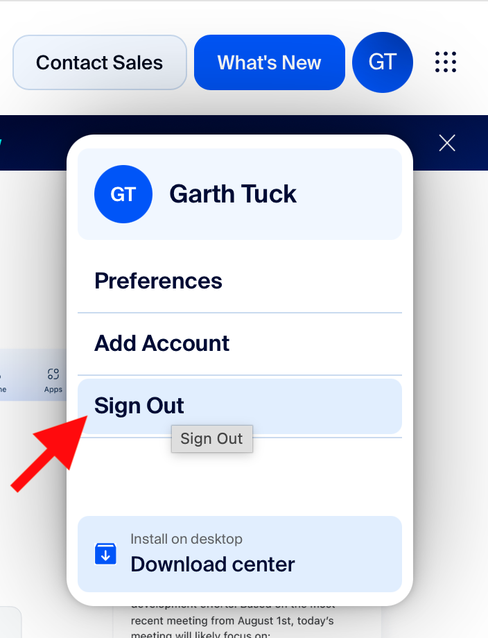
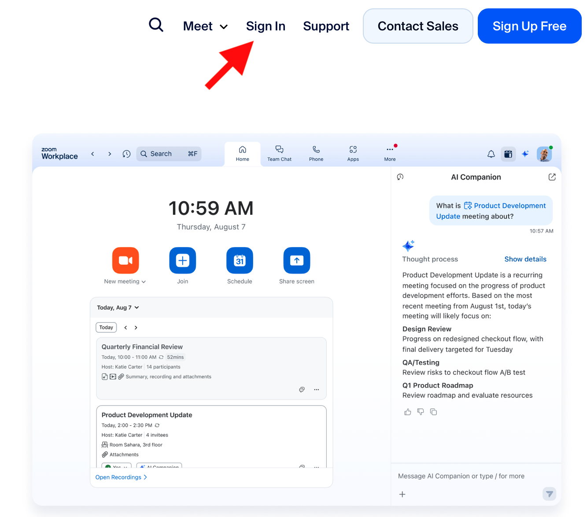
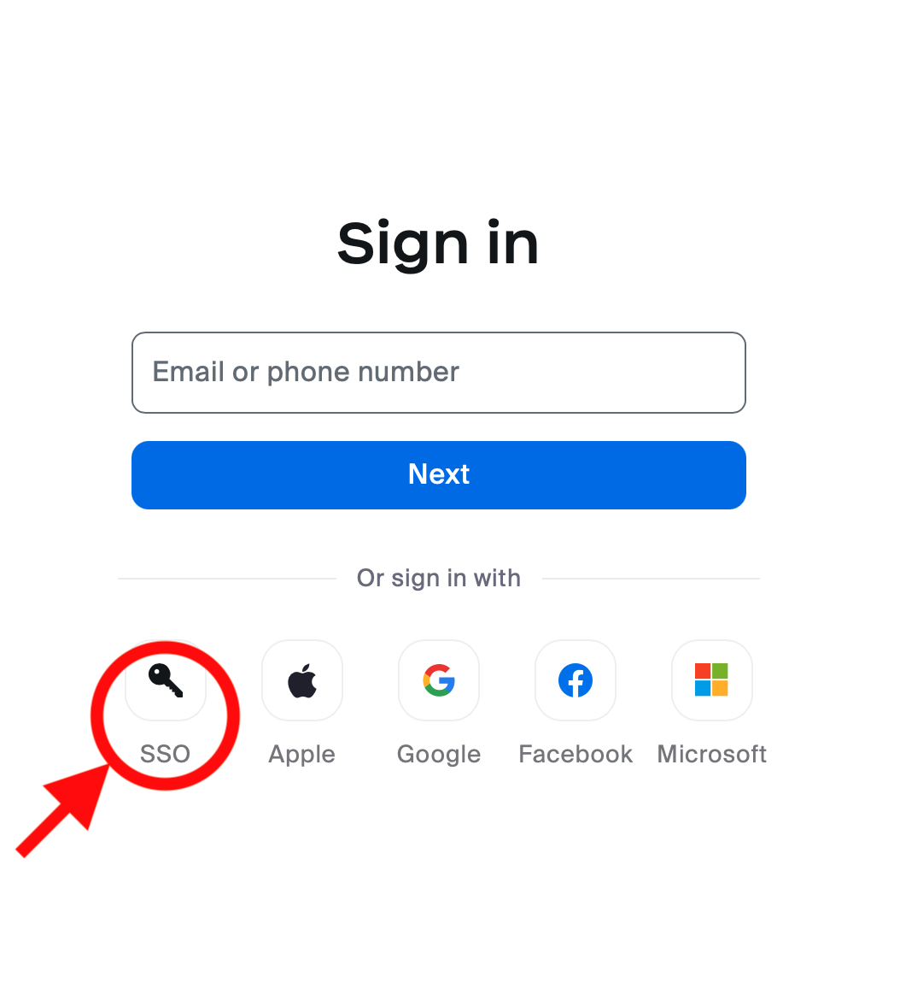
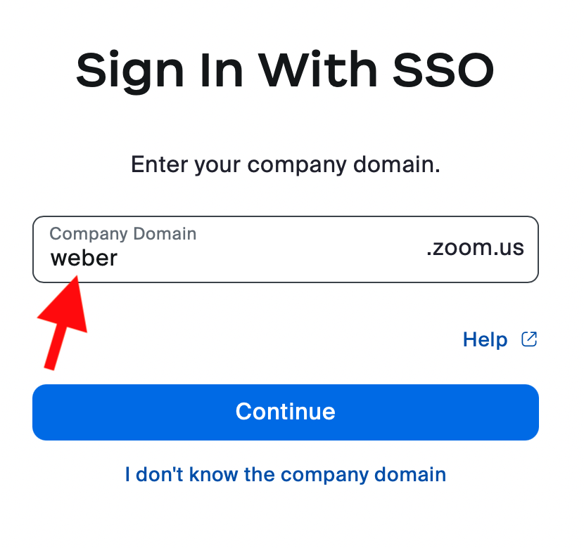
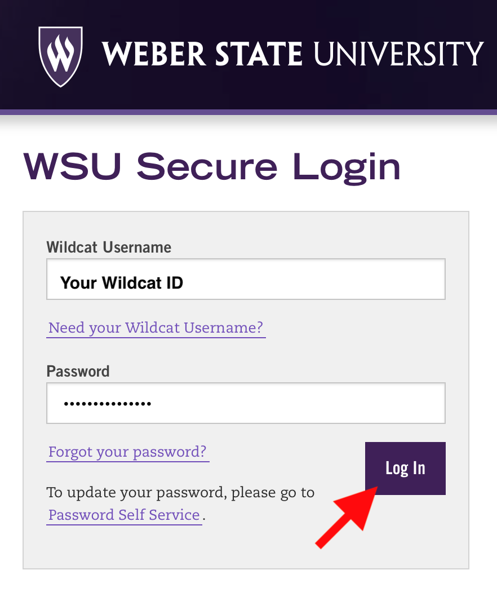
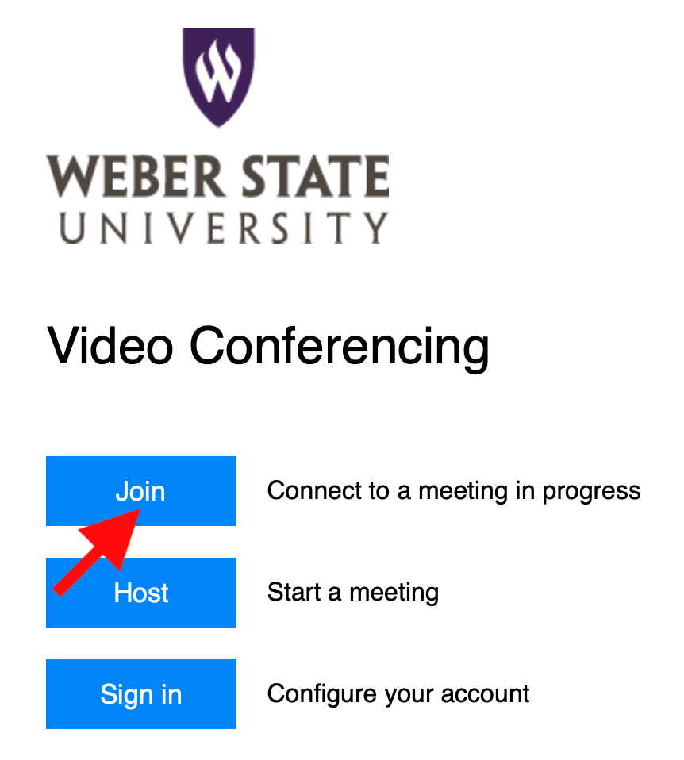
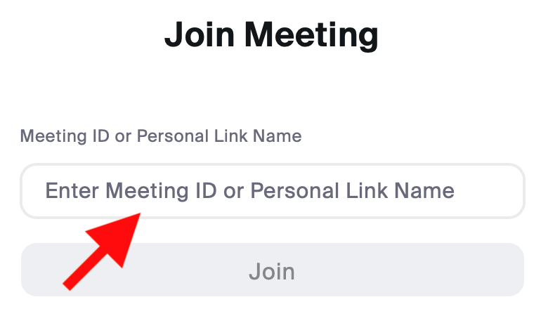

# Logging in to Zoom with SSO (Single Sign-On)

This tutorial will guide you through the process of logging in to Zoom using Weber State University's SSO (Single Sign-On). Follow the steps below in order.

> **⚠️ Important:** If you skip **Step 1 (Sign Out)**, you may remain signed in with a personal Zoom account (such as Gmail).  
> This often prevents you from joining WSU classes. Always start by signing out.

---

## Step 1 – Sign Out of Zoom
If you are already signed into Zoom with a personal account, first **sign out**.  

---

## Step 2 – Go to the Zoom Sign In Page
From the Zoom website, click on **Sign In**.  

---

## Step 3 – Select SSO (Single Sign-On)
On the sign-in page, click the **SSO** option.  

---

## Step 4 – Enter Your Company Domain
Type `weber` into the **Company Domain** field, then click **Continue**.  

---

## Step 5 – WSU Secure Login
You will be redirected to Weber State University’s secure login page. Enter your **Wildcat ID** and **Password**, then click **Log In**.  

---

## Step 6 – Choose “Join” to Enter a Meeting
After signing in, select **Join** to connect to your meeting.  

---

## Step 7 – Enter the Meeting ID
Type in the **Meeting ID or Personal Link Name** provided by your instructor, then click **Join**.  

---

✅ You are now signed into Zoom using Weber State University’s SSO and ready to join your class meetings.

---

## 🔧 Troubleshooting Tips

If you have issues logging in with SSO, try these steps:

1. **Clear Old Sessions**  
   - Sign out of Zoom completely on all devices (computer, phone, tablet).  
   - Then restart Zoom and try again from Step 1.

2. **Update Zoom**  
   - Make sure your Zoom app is up to date. Outdated versions may not support SSO login correctly.

3. **Use the Correct Domain**  
   - Make sure you entered `weber` (not `weber.edu`) for the company domain.  
   - It should read: `weber.zoom.us`

4. **Browser Pop-Up Blockers**  
   - If using Zoom in a browser, allow pop-ups — the login redirect may be blocked.

5. **Still Having Problems?**  
   - **Schedule an appointment with me:** [Book a time here](https://calendar.google.com/calendar/u/0/appointments/schedules/AcZssZ2ZxOHd88y9dR5ZmI1YgcfcnhVGj2lfXlknmyVUPbRtVoTjHj3OJbIADiaxM2RC9pGFkeTWF6CK?gv=true)  
   - Or contact the **WSU IT Service Desk**: [https://www.weber.edu/help](https://www.weber.edu/help)  
     - Phone: 801-626-7777  
     - Email: csupport@weber.edu  

---
